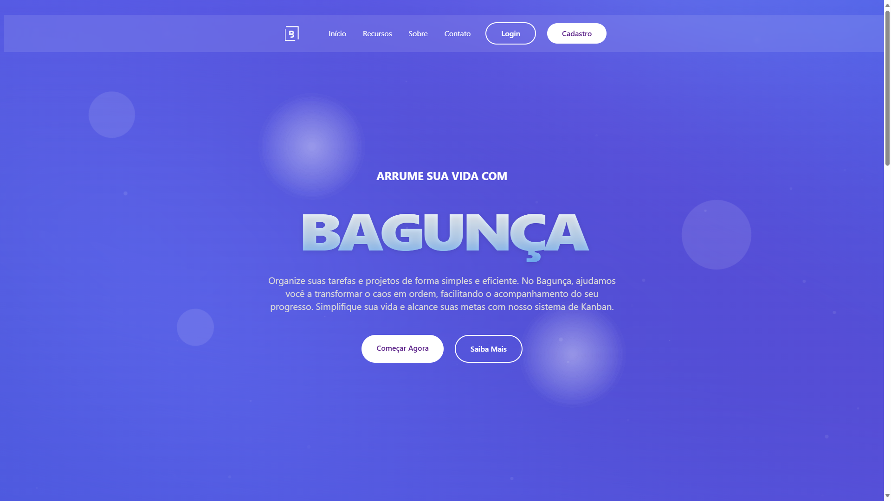
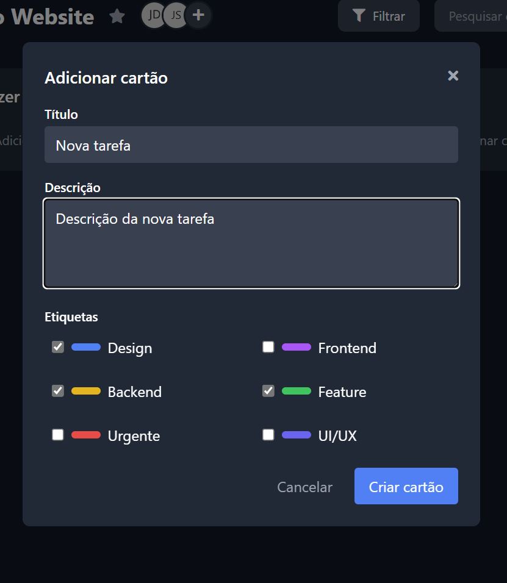

<h1 align="center">🌟 Bagunça - Projeto Integrador SENAC-DF 🌟</h1>

<strong>Bem-vindo ao repositório do Bagunça</strong>, um website inovador para organização pessoal, desenvolvido como parte do Projeto Integrador (PI) do SENAC-DF. 📋 Este projeto foi criado com foco em jovens universitários que trabalham em grupo e precisam gerenciar tarefas de forma prática e eficiente. 🚀

<h2 align="center">📖 Descrição do Projeto</h2>

O Bagunça é uma ferramenta projetada para auxiliar jovens universitários na gestão de suas tarefas e projetos colaborativos. Inspirado em plataformas como o Trello, utiliza metodologias ágeis, como Scrum e Kanban, para oferecer uma solução intuitiva e visual que ajuda a organizar o caos do dia a dia acadêmico e profissional.

<h2 align="center">🛠️ Funcionalidades</h2>

✅ Criar, editar e excluir tarefas com facilidade.

✅ Organizar tarefas em listas personalizadas para diferentes projetos ou disciplinas.

✅ Acompanhar o progresso de atividades em grupo de forma clara e visual.

✅ Gestão de perfil e senha do usuário, garantindo segurança e personalização.

✅ Temas de acessibilidade (alto contraste) e controle de tamanho da fonte.

<h2 align="center">🎯 Público-Alvo</h2>

O Bagunça foi idealizado especialmente para jovens universitários que:

👥 Trabalham em projetos em grupo para disciplinas ou atividades extracurriculares.

⚖️ Precisam gerenciar múltiplas tarefas, equilibrando estudos, trabalho e vida pessoal.

🔍 Buscam uma ferramenta simples, acessível e visual para organizar suas responsabilidades.

<h2 align="center">🏫 Sobre o SENAC-DF</h2>

Desenvolvido no SENAC-DF, o Bagunça reflete o compromisso da instituição em formar profissionais capacitados, promovendo o aprendizado prático e o desenvolvimento de soluções inovadoras voltadas para as necessidades reais do mercado.

<h2 align="center">📸 Prévia da Plataforma</h2>

<h2 align="center">💻 Tecnologias Utilizadas</h2>

🌐 HTML5 e CSS3: Estrutura e design da interface.

⚡ JavaScript: Interatividade e funcionalidades dinâmicas.

💻 Node.js e Express: Ambiente de execução e framework para o backend.

💾 MongoDB Atlas: Banco de dados NoSQL para persistência dos dados.

🎨 Tailwind CSS: Estilização moderna e responsiva.

✨ Font Awesome: Ícones para uma experiência visual mais rica.

<h2 align="center">📦 Dependências do Backend</h2>

Para que a aplicação funcione corretamente, é necessário instalar as seguintes dependências com o npm:

npm install express mongoose cors dotenv bcryptjs jsonwebtoken

express: Framework web para Node.js, usado para criar a API REST.

mongoose: Modelagem de objetos para MongoDB, facilitando a interação com o banco de dados.

cors: Middleware que permite que a API seja acessada por diferentes domínios (frontend).

dotenv: Carrega variáveis de ambiente de um arquivo .env para o process.env.

bcryptjs: Biblioteca para hash de senhas, garantindo a segurança dos dados do usuário.

jsonwebtoken: Cria e verifica tokens de autenticação (JWT) para proteger as rotas da API.

<h2 align="center">📸 Prévia do Design</h2>

<h2 align="center">📸 Mais Prévias</h2>

<h2 align="center">👥 Contribuidores</h2>

Conheça os talentos por trás do Bagunça!

<ul>
<li><a href="https://github.com/YanFellippe"><strong>Yan Fellippe</strong></a> - Gerente do Projeto e Desenvolvedor Fullstack</li>
<li><a href="https://github.com/ruandd9"><strong>Ruan Lobo</strong></a> - Subgerente e Desenvolvedor Fullstack</li>
<li><a href="https://github.com/talissonleandro"><strong>Talisson Leandro</strong></a> - Desenvolvedor Fullstack e Designer</li>
<li><a href="https://github.com/douglasarj"><strong>Douglas Araújo</strong></a> - Desenvolvedor Fullstack e Designer</li>
<li><a href="https://github.com/dragonkiri"><strong>Raphael Melo</strong></a> - Desenvolvedor Fullstack e Designer</li>
</ul>

<h2 align="center">🤝 Como Contribuir</h2>

Quer ajudar a tornar o Bagunça ainda melhor? Siga os passos abaixo!

🍴 Faça um fork deste repositório.

🌿 Crie uma branch para suas alterações: git checkout -b minha-contribuicao

💾 Implemente suas melhorias e faça commit: git commit -m 'Adicionando minha contribuição'

🚀 Envie para o repositório remoto: git push origin minha-contribuicao

📬 Abra um Pull Request para revisão.

<h2 align="center">📧 Contato</h2>

Tem dúvidas, sugestões ou feedback? Entre em contato!

📩 Email: ruanoliveiralobo@gmail.com

<h2 align="center">ℹ️ Sobre</h2>

O Bagunça foi desenvolvido como parte do Projeto Integrador do SENAC-DF, uma iniciativa que incentiva os alunos a aplicar conhecimentos técnicos em projetos práticos e inovadores. Este projeto destaca o compromisso do SENAC em preparar jovens para o mercado de trabalho, desenvolvendo soluções que atendem às demandas reais de organização e produtividade, especialmente para universitários que precisam gerenciar tarefas em equipe.

<h1 align="center">⭐ Obrigado por conhecer o Bagunça! ⭐</h1>

Junte-se a nós e transforme a organização de tarefas em algo simples e colaborativo para jovens universitários! 🚀

